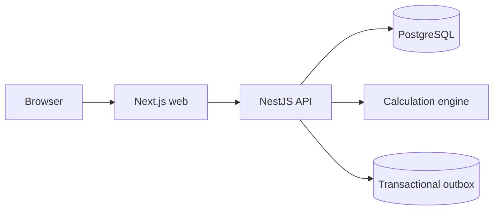
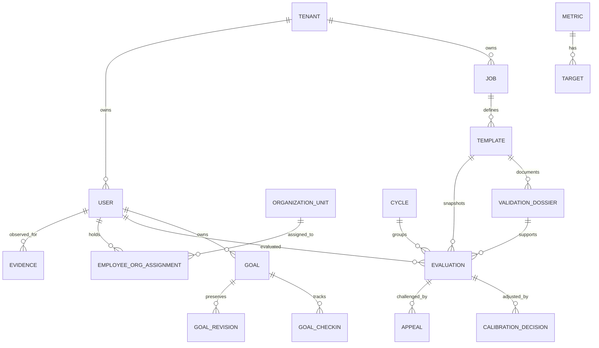

# Architecture overview

This repository is an **early implementation**, not a validated enterprise release. It uses a pnpm monorepo with a Next.js web application, a NestJS API, PostgreSQL persistence, a shared input contract package, and a pure decimal calculation package.

The score path reads an active job template, verified period evidence, and the applicable versioned target. It saves both the complete input snapshot and the result trace. Replaying the snapshot does not read current targets or evidence. It also saves the dated organization assignments active at the cycle end as separate descriptive context. A calibration decision is stored separately from the calculated score. Review conflict declarations can hold submission, calibration, and publication until an independent resolver assigns a replacement actor. Administrative publication checks a current, independently reviewed model evidence dossier and saves its ID, and rejects publication while a safety or compliance case is triaged or confirmed or a context record for the cycle awaits review. Review discussion messages have separate employee-shared and internal visibility and are kept outside the calculation. Goals, check-ins, development actions, formal improvement plans, governance cases, and context records are separate and do not silently change the authoritative score. The trend read model derives descriptive statistics from published saved calculated scores within the same role template and review purpose; it does not forecast or modify an evaluation.

Tenant-owned tables carry `tenant_id`, composite foreign keys, and PostgreSQL row-level policies. Application queries also constrain by tenant. The production API role must be a non-owner role so row-level policies are enforced. A tenant administrator is bootstrapped through the migration connection.

The current service is a modular foundation with one performance application service. It has not yet been split into the requested bounded contexts. The outbox is written transactionally; no delivery worker is implemented. The web uses the server API as its score source.

## Data relationships

## Decision record: ADR-001

**Decision:** Start with a modular monolith and PostgreSQL `NUMERIC` fields. Keep the calculation engine pure and independent of HTTP and persistence.

**Reason:** This keeps authoritative scores testable and replayable while avoiding premature distributed consistency problems. PostgreSQL transactions can atomically persist evaluation, audit, and outbox records.

**Trade-off:** The current application service is still too broad and needs extraction into domain contexts before the requested full platform can be claimed.
